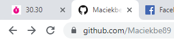

### Stopwatch by [@Maciekbe89](http://github.com/Maciekbe89)!

I created this app in vanilla javascript. 

## design

<<<<<<< HEAD
The app also works with not focused cards. The timer is visible in the card's title.
=======
The app also works when you're going to browse diffrent pages on another cards. Timer can you see in title.
>>>>>>> ad312114f65bae37a32857270335da5b90e669f3

